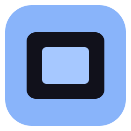
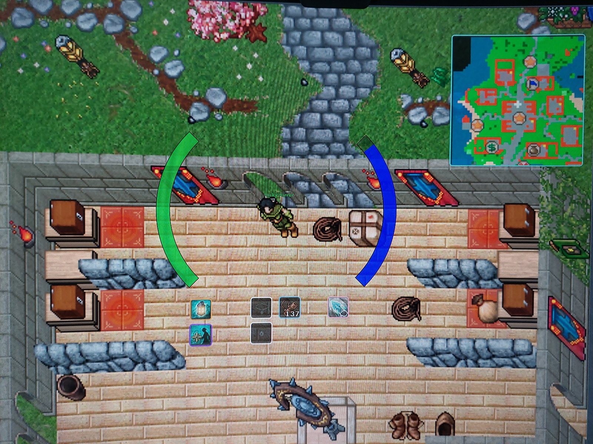
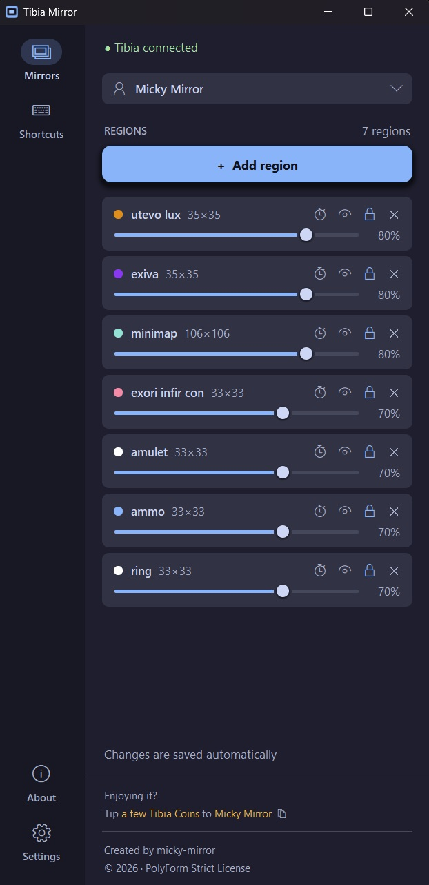
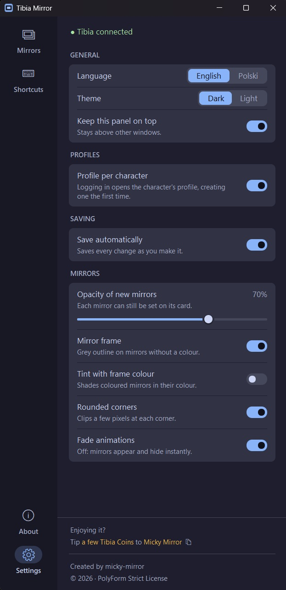
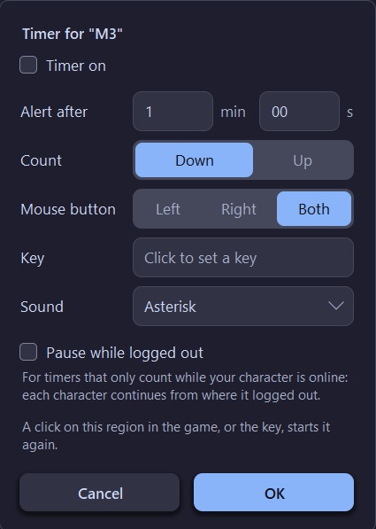

<p align="center">
  
</p>

<h1 align="center">Tibia Mirror</h1>

<p align="center">
  <b>Keep your eyes on the fight, not on the corners of the screen.</b>
  <br>
  Cooldowns, the minimap, anything you like: copied into small windows you can place anywhere.
</p>

<p align="center">
  
  
  
  
  <a href="LICENSE.md"></a>
</p>

<p align="center">
  <a href="https://github.com/micky-mirror/tibia-mirror/releases/latest/download/Tibia.Mirror.exe"></a>
</p>

<p align="center">
  
  <br>
  <sub>Mirrors in the game: the minimap and a few basic spell icons, each in a framed window you can place anywhere and tailor to your needs: size, opacity, frame colour, timer and more.<br>
  Photo taken with a phone: on your own screen, the mirrors look as sharp and smooth as the game itself.</sub>
</p>

<p align="center">
  
  &nbsp;
  
</p>

---

> [!NOTE]
> **Safe by design**
> - It shows what Tibia already draws, through Windows' own window previews (the same ones the taskbar uses).
> - No screen capture, no memory reading, nothing injected into the game.
> - It never clicks, types or moves the mouse for you, and never changes Tibia's window.
> - Nothing is sent anywhere.

## 🚀 Quick start

Tibia Mirror runs on **Windows 11**, where it is tested.

1. Download `Tibia Mirror.exe` with the button above.
2. Start Tibia.
3. Double-click `Tibia Mirror.exe`.
4. Click **Add region**, drag a box over the part of the game you want, and name it.
5. Drag the new mirror wherever you like.
6. Press **Save**, or turn on **Save automatically** in Settings.

> [!TIP]
> The first time, Windows may say "Windows protected your PC", because the file isn't signed.
> Click **More info**, then **Run anyway**.

The app finds Tibia by itself: the panel shows "Waiting for Tibia..." until it's running, and reconnects if Tibia restarts.
Only one copy of the app runs at a time: starting it again brings the open panel to the front.
The panel opens where you left it, at the same size (centred if that spot is no longer on a screen).

## 🪟 Mirrors

### Adding a region

1. Make sure the part of Tibia you want is in view (Tibia must not be minimized).
2. Click **Add region** and drag a box over the game.
3. Name the region and press **OK** (or <kbd>Enter</kbd>).

A mirror of that region appears right next to it, ready to be dragged into place.

> [!TIP]
> While you select, a magnifier beside the pointer shows the game enlarged, with the exact pixel framed.
> The arrow keys <kbd>←</kbd> <kbd>↑</kbd> <kbd>→</kbd> <kbd>↓</kbd> shift the selected point by 1 pixel (<kbd>Shift</kbd>: 10), even while the mouse button is held.
> The mouse pointer itself never moves.
> <kbd>Esc</kbd> cancels.

The app never brings Tibia to the front by itself.

### The region card

Every mirror has a card on the Mirrors page.
Hover any icon on it for a short explanation.

| On the card | What it does |
|---|---|
| 🎨 Colour dot | Pick the frame colour, to tell similar mirrors apart |
| Name | Double-click to rename |
| Size, e.g. `77×83` | Edit position, size and zoom exactly (see below) |
| ⏱️ Stopwatch | Set up a timer (blue while on) |
| 👁️ Eye | Show or hide this mirror (a hidden one stays in the list, dimmed) |
| 🔒 Padlock | Lock it: it can't be moved and clicks go through it to the game |
| ✕ | Remove it |
| Slider | Opacity, from 10% to 100% |

Hovering a card also shows its mirror at full opacity with a wider frame, so you can find it, even while mirrors are hidden.

### Working with a mirror

| To | Do this |
|---|---|
| Move it | Left-drag it |
| Resize it | Drag its bottom-right corner (the cursor changes there); proportions are kept |
| Remove it | Right-click it (when unlocked) and choose **Remove**, or click ✕ on its card |

New mirrors start at actual size and 50% opacity, with a thin grey frame.
Zoom goes from 25% to 400%.

**Frame colours**: the picker has soft shades, deep ones and white; arrow keys and <kbd>Enter</kbd> work too.
Coloured frames are a bit thicker and always show.
Only the frame is coloured, unless **Tint with frame colour** is on in Settings.

### Editing a region exactly

Click the size on a card to open the Region dialog:

- Set X, Y, width and height in game pixels, and the zoom.
  The mirror shows each change live; **Cancel** puts everything back.
- <kbd>↑</kbd> / <kbd>↓</kbd> in a field changes it by 1 (<kbd>Shift</kbd>: 10).
- **Apply size and zoom to all mirrors** gives every mirror the same shape (each keeps its centre).
- **Select area again** lets you drag out a new area, keeping the mirror's name, opacity and position.

## ⏱️ Timers

Click the stopwatch on a card to give that mirror a timer.

<p align="center">
  
</p>

| | How it works |
|---|---|
| **Start** | Click the region in the game (left, right or either button, as you choose), or press the mirror's key. The next click or key press restarts it. |
| **Time** | Counts down (or up) to an alert time from 0:01 to 59:59, on a small badge just below the mirror. |
| **Time's up** | Plays the sound you picked (or none) and stays on its final value in red. |
| **Key** | Can include <kbd>Ctrl</kbd>, <kbd>Shift</kbd> and <kbd>Alt</kbd>, like <kbd>Shift</kbd>+<kbd>F9</kbd>. It must match exactly, so <kbd>F9</kbd> alone doesn't start a <kbd>Shift</kbd>+<kbd>F9</kbd> timer. |

Clicks only count when they land on Tibia, and keys only while Tibia is the active window.
Timers keep running while a mirror is hidden, and start fresh when the app restarts.

> [!IMPORTANT]
> The app only reminds you: it never presses a key or clicks for you when a timer ends.

### Pause while logged out

**Pause while logged out** in the Timer dialog is on for new timers, so they only count while your character is online.
Untick it for a timer that should keep counting on the login screen.
With it on:

- On logout the timer pauses, and its badge shows the time dimmed.
- When that character logs in again, it continues from there, even after an app restart.
- Each character keeps its own progress, even on a shared profile.
- It can't be started while no one is logged in.

> [!WARNING]
> If the app is closed while you're still logged in, those timers start fresh, since the app can't know how long you stayed online.

### Hiding all mirrors

Press the hide-all key (set it on the **Shortcuts** page) while Tibia is active, and again to bring them back.
Mirrors hidden with their eye stay hidden.
While they're hidden, the top of the panel says so, e.g. "Mirrors hidden (Ctrl+H)".

### When mirrors show

- Mirrors show while Tibia is in front, and fade out when you switch to another app.
- In the panel they stay as they were: visible if you came from Tibia, hidden if you came from, say, a browser.
- They follow the Tibia window when it moves.
- Each game window size (e.g. windowed and fullscreen) has its own layout.
  The first time at a new size, the app makes a proportional guess; adjust it once and it's remembered.

## 📁 Profiles

A profile is a named set of mirrors: one per character, or one for hunting and one for PvP.
Click the box at the top of the Mirrors page to switch profiles or manage them.

| Menu item | What it does |
|---|---|
| New profile | Starts empty |
| Duplicate | Copies what's on screen, unsaved changes included, and switches to it |
| Rename | Renames the active profile |
| Characters | The characters whose login opens this profile (see below) |
| Copy from | Replaces this profile's mirrors with another's; **Revert** undoes it until you save (Tibia must be running) |
| Import / Export | Load or save a profile as a file: the easy way to move your mirrors to another PC |
| Delete profile | Asks first; the last profile can't be deleted |

### Profile per character

Turn on **Profile per character** in Settings, and logging in opens the character's own profile.
The app only reads the character's name from Tibia's window title ("Tibia - Knight Name").

- A character's first login creates a profile for it: a copy of the active one, named after the character.
  An existing profile with that name, not used by another character, is used instead.
- Rename it as you like (e.g. "EK"): the character stays linked.
- Several characters can share a profile: add their exact names under **Characters**.
- With unsaved changes you're asked first; **Cancel** keeps the current profile.
- Logging out leaves the current profile open.

## 💾 Saving

Changes to mirrors are kept in the active profile when you press **Save**; **Revert** throws them away.
The line under the buttons says whether anything is unsaved.
Switching profiles or closing the app asks first if there are unsaved changes.

With **Save automatically** on, every change is saved right away and the buttons disappear.

## ⚙️ Settings

Settings apply immediately.

| Setting | What it does | Default |
|---|---|---|
| Language | English or Polish | English |
| Theme | Dark or light | Dark |
| Keep this panel on top | The panel stays above other windows | Off |
| Profile per character | Logging in opens the character's profile | Off |
| Save automatically | Saves every change as you make it | Off |
| Opacity of new mirrors | Starting opacity of new mirrors | 50% |
| Mirror frame | Thin grey outline around mirrors without a colour | On |
| Tint with frame colour | Coloured mirrors are also shaded with their colour | Off |
| Rounded corners | Windows 11's rounded corners (clips a few pixels, adds a faint shadow) | Off |
| Fade animations | Mirrors fade in and out instead of appearing instantly | On |

## ⌨️ Shortcuts

| Shortcut | What it does | Default |
|---|---|---|
| Hide all mirrors | Hides every mirror, and brings them back | None |

Click the field and press the keys together; ✕ clears it.
A key already used by a timer can't be chosen.

> [!TIP]
> Tibia receives the key too, so pick one it doesn't use.

## 🗂️ Your data

Profiles, settings and the error log are in `%APPDATA%\Tibia Mirror`.
Updating the `.exe` keeps them.
Each profile is a plain JSON file, safe to edit or share.

If something goes wrong, the details are in `error.log` there: errors only, never what you click or type.
If the app can't start at all, a message says so and names this file.

## 📜 License

Tibia Mirror is free to use, and its code is public to read, under the [PolyForm Strict License 1.0.0](LICENSE.md).

- ✅ Use it for any noncommercial purpose, including while streaming or recording videos, monetized ones too.
- ❌ Don't share copies, change it, or build on its code: get it from the official release page only.
- ❌ Contributions are not accepted.

The streaming permission, and the licenses of the open-source software inside the `.exe`, are in [NOTICE.md](NOTICE.md).

<sub>Tibia is a trademark of CipSoft GmbH; this fan-made tool is not affiliated with or endorsed by CipSoft.</sub>

---

<details>
<summary><b>🛠️ For developers</b></summary>

### Running from source

Windows 11 and Python 3.10 or newer; no third-party packages are needed to run it.

```
python main.py
```

A run from source shares its data with the `.exe`.

### Checks

Install the dev tools into the project virtual environment, then run the checks:

```
.venv\Scripts\python -m pip install --group dev
.venv\Scripts\python -m pytest
.venv\Scripts\python -m ruff check .
.venv\Scripts\python -m ruff format --check .
.venv\Scripts\python -m mypy
```

The code is fully type-annotated and mypy runs in strict mode.

### Building the .exe

```
.venv\Scripts\python -m PyInstaller "Tibia Mirror.spec"
```

This makes a single `dist\Tibia Mirror.exe` with the icon, name, version and copyright in its Properties.
The version comes from `tibia_mirror/__init__.py`; keep `pyproject.toml` in step (a test checks this).

### Project layout

```
main.py                 entry point
Tibia Mirror.spec       the .exe build (PyInstaller)
tibia_mirror/
  app.py                App: owns runtime state, wires windows together
  config.py             paths, sizes, poll intervals
  i18n.py               English and Polish text
  about.py              author, contact, tip character, copyright years
  errors.py             the error log
  core/                 pure logic: no Windows or Tk code
    geometry.py         pure coordinate math
    regions.py          saved regions and JSON persistence
    profiles.py         profiles: one saved set of regions per file
    settings.py         app settings and settings.json
    characters.py       linking characters to profiles
    timers.py           timer settings and what the badge shows
    visibility.py       when mirrors are shown
    handles.py          the Hwnd name for window handles
  winapi/               everything that calls Windows
    win32.py            ctypes bindings and window helpers
    dwm.py              DWM thumbnail wrapper (the core mechanism)
    tibia.py            finding the Tibia client window
    rawinput.py         being told of clicks and key presses (Raw Input)
    instance.py         one copy at a time
    sounds.py           timer alert sounds
  services/             the pieces of the running app that App wires together
    active_profile.py   the profile that is open now
    game.py             the Tibia window and its client area
    mirrors.py          the mirror windows on screen
  assets/icon.ico       the app icon
  ui/                   everything drawn with Tk
    base/               themes, display scaling, shape rendering, helpers
    controls/           custom widgets, menus, slider, tooltips, dialogs
    overlay/            mirror window, timer badge, selection overlay, magnifier
    panel/              control panel, its menu rail and pages
tests/                  unit tests for the non-GUI modules
docs/                   architecture, images
```

### Documentation

- [Architecture](docs/architecture.md): how the app works and how the modules fit together.

</details>
