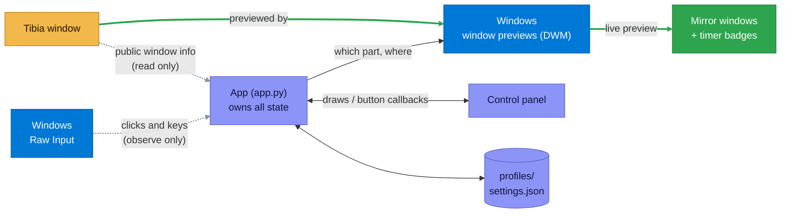

# Architecture

A short tour of how Tibia Mirror works.
For the details, follow the file names into the code.

## Overview

Windows itself draws a live preview of Tibia inside each mirror, the same way the taskbar previews windows.
The app never receives the game's image: it only tells Windows which part of Tibia to show, and where.

The app knows Tibia only from what Windows shows every program about any window, as the taskbar and Alt+Tab do: its title, whether it's minimized, and where it is, so the mirrors can follow it.
To make sure the window is really Tibia, it also reads the program's file path, using the lowest access level Windows offers (`PROCESS_QUERY_LIMITED_INFORMATION`), which gives no access to the game's memory.

- **`App`** (`app.py`) owns all state: the Tibia window, the mirrors, the active profile and the settings.
  It runs a few timers on Tk's event loop (the "polls") and reacts to the panel's buttons.
- **The UI** (`ui/`) is a pure view: it draws what the App gives it and calls back into the App.
- **Pure logic** (geometry, regions, profiles, settings, timers, visibility, rendering) has no Windows or Tk code, so it is unit-tested.

## Mirrors: DWM thumbnails

The app never captures the screen.
It asks the Windows compositor (DWM) to draw a live copy of part of Tibia's window into a mirror window (`dwm.Thumbnail`), the same way the taskbar shows window previews.

- The copy is live and costs nothing: there is no refresh loop.
- The app never receives the game's image.
- It works with Tibia in real fullscreen, where screen capture shows a black image.

Each mirror (`ui/mirror.py`) is a borderless, always-on-top window:

- **Opacity** is the window's alpha, which also applies to the copied image.
- **Locked** mirrors are click-through, so clicks reach the game.
- **Rounded corners** use Windows 11's own rounding, the only kind that also clips the image.
  The frame is then a second window behind the image.
- **Timer badges** are small windows of their own just below the mirror, since nothing can be drawn over the copied image.

### Layouts per window size

Tibia's panels don't scale with its window, so a mirror keeps one **layout per client size** (e.g. windowed and fullscreen).
A layout is the region shown plus the mirror's position relative to the game window, so mirrors follow Tibia when it moves.
For a new size, `regions.guess_layout` makes a proportional first guess; adjusting it makes it the layout for that size.

## Finding Tibia

`tibia.py` looks for a window whose title starts with "Tibia" and whose program is `...\Tibia\bin\client.exe`.
The title alone isn't enough: other windows (an editor, the app's own panel) can contain "Tibia" too.
Reading the program's path uses the lowest access level Windows offers (`PROCESS_QUERY_LIMITED_INFORMATION`), which gives no access to the game's memory.

- Until Tibia is found, the panel shows "Waiting for Tibia..." and the App retries every second.
- When Tibia closes, the mirrors keep their settings and reconnect to the new window once Tibia starts again.
- A minimized Tibia has no client area, so mirrors wait until it's restored.

## When mirrors show

Mirrors should show while the player is looking at Tibia (`core/visibility.py`):

- They show while Tibia is the foreground window.
- While one of the app's own windows is in front (the panel, a dialog), the last *other* window decides: coming from Tibia keeps them visible, coming from a browser keeps them hidden.
- They hide while a region is being selected, and while the hide-all key is active.

## Input and timers

Clicks and key presses come from Windows **Raw Input** (`rawinput.py`), which only observes: it can't block, change or send input.

> [!WARNING]
> Raw Input messages arrive inside Tk's event loop, and calling Tk from there crashes Python.
> So the watcher only queues each event, and a short Tk timer hands the queue to the App.

- A click starts the timers whose region it hits, but only if it landed on Tibia.
- A key starts the timers bound to exactly that combination, but only while Tibia is in front.
- A key combination does one thing only: the hide-all key and timer keys can't clash.
- The pure timer logic (what the badge shows, key matching, paused progress) is in `core/timers.py`.

**Pause while logged out**: the App reads the logged-in character from Tibia's window title ("Tibia - Name").
Running timers' start times are kept in memory; at logout they become paused progress in `settings.json`, per character and per mirror id, and continue at the next login.

## Profiles and settings

- **Profiles** (`core/profiles.py`, `core/regions.py`) are JSON files, one per profile, in `%APPDATA%\Tibia Mirror\profiles`.
  Each mirror has a permanent hidden `id`, a name, opacity, zoom, colour, timer and its layouts.
  Older file formats still load.
- **Unsaved changes** are found by comparing what Save would write with the file as loaded, so undoing a change by hand clears the flag.
- **Settings** (`core/settings.py`) are saved to `settings.json` shortly after each change.
  Bad or unknown values fall back to defaults, so a hand-edited file never stops the app from starting.
- **Profile per character** (`core/characters.py`) links character names to profiles in `settings.json`.
  A login switches profiles through the same "save changes first?" flow as switching by hand, and waits while a dialog is open.

## The control panel

The panel is plain Tk, made to look modern without third-party packages:

- **Rounded, anti-aliased shapes and shadows** (buttons, cards, fields) are drawn in code in `ui/render.py` and cached.
- **Cards, the menu rail and settings groups** are drawn on one canvas each and hit-tested by position, for clean hover handling.
- **Themes** (`ui/theme.py`): colours are read when a widget is drawn, never copied at import time.
  Switching theme or language rebuilds the panel on the same page.
- **Languages** (`i18n.py`): every user-facing text goes through `tr()`; a test fails if any has no Polish translation.
- **Size and place**: the first time, the panel opens centred, tall enough for the whole Settings page, and shorter on small screens (pages scroll).
  After that it opens where it was last, its size shrunk to fit if needed (`panel_rect` in `settings.json`).
  If what it shows (title bar and inside) wouldn't be fully on a screen, for example after a monitor was unplugged, it opens centred instead.
  The check leaves out Windows' invisible resize borders, so a panel dragged against a screen edge stays there.
- **Display scaling** (`ui/scale.py`): Tk scales fonts with Windows' display scaling, but not pixel sizes.
  So every size is written as its value at 100% and goes through `px()` where it is used, so boxes grow with their text.
  The scale is read once at startup from Tk, and the theme's button styles are built after it.
  Game coordinates (regions, mirror positions and sizes) never go through `px()`.
  Rounded shapes are rendered at the scaled size, so they stay sharp; rows of a shape's straight middle are identical, so each is computed once.

## Startup, data and errors

1. **One copy at a time** (`instance.py`): a named mutex marks the running copy.
   A second copy signals it to show its panel, and quits before touching any data.
2. **Error log** (`errors.py`): the `.exe` has no console, so errors and crashes go to `error.log`, which is trimmed once it's large.
   If the app can't even open its panel, a message box names the log.
3. **Data** lives in `%APPDATA%\Tibia Mirror`, shared by the `.exe` and a run from source.

The `.exe` is built with PyInstaller from `Tibia Mirror.spec` (single file, no console, no UPX, which antivirus programs dislike).
It leaves out standard-library parts the app never runs (OpenSSL, sockets, compression, `decimal`), so it ships no network code; `NOTICE.md` lists the open-source software it does include.

## Safety rules

These are deliberate and must stay true:

- Nothing reads or changes the game's memory or files.
- Nothing moves the mouse pointer or sends input: no `SetCursorPos`, `SendInput` or `mouse_event`.
- Nothing changes Tibia's window; the app only reads the public window info every program can see, and shows the window through DWM.
- Timers only alert: they never press keys or click when they end.
- Nothing is sent over the network.

## Code map

| Area | Files |
|---|---|
| App and startup | `app.py`, `main.py`, `instance.py`, `errors.py`, `config.py` |
| Windows and Tibia | `win32.py` (all Win32 calls), `dwm.py`, `tibia.py`, `rawinput.py`, `sounds.py` |
| Pure logic | `core/geometry.py`, `core/regions.py`, `core/profiles.py`, `core/settings.py`, `core/characters.py`, `core/timers.py`, `core/visibility.py`, `core/handles.py` |
| Text | `i18n.py`, `about.py` |
| Mirrors | `ui/mirror.py`, `ui/badge.py`, `ui/selector.py`, `ui/loupe.py` |
| Panel | `ui/panel.py`, `ui/nav.py`, and the pages: `ui/mirrors_page.py`, `ui/settings_page.py`, `ui/shortcuts_page.py`, `ui/about_page.py` |
| Widgets | `ui/widgets.py`, `ui/menu.py`, `ui/dialogs.py`, `ui/tooltip.py`, `ui/slider.py` |
| Drawing | `ui/render.py`, `ui/theme.py`, `ui/scale.py`, `ui/animation.py`, `ui/images.py`, `ui/text.py` |

## Conventions

- State lives on `App`; UI classes get callbacks, never globals.
- Every Win32 function is declared once, with its argument and return types, in `win32.py` or `dwm.py`.
- Pure modules stay free of Win32 and Tk, so they stay testable.
- Every extra window says what a close request (Alt+F4) means: dialogs cancel, menus close, mirrors and badges ignore it (`ui/windows.py`); a test checks each one.
- Everything is type-annotated and `mypy --strict` passes.
- Names are spelled out (`mirror`, `profile`, `middle_y`).
  Short names are kept only where they're the usual convention: `e` for a Tk event, `x, y, w, h`, `x0, y0, x1, y1`, `i`, `lo, hi`, and the Windows terms `hwnd` and `vk`.
- Screen rectangles are `geometry.Rect`, never bare tuples.
